<h3><code>eugenetur@github ~ $ whoami</code></h3>

<table>
<tr>
<td valign="top"></td>
<td valign="top"></td>
</tr>
</table>

### Hi, I'm Eugene

I'm a **Junior Data Analyst**.
My interests include data cleaning, SQL analysis and data visualisation.
I'm continuing to develop my skills in **Excel, SQL and Power BI**.

### Projects and practice

- **[Prague rental map](https://github.com/eugenetur/prague-rental-map)** — an interactive map for comparing rental listings in Prague.
- **[SQL practice](https://github.com/eugenetur/MySQL)** — a guided COVID-19 data exploration project using joins, aggregations and window functions.
- **[Excel practice](https://github.com/eugenetur/Excel)** — learning projects and exercises.

### Certificates

[View my certificates](https://github.com/eugenetur/Certificates)

