  

### Hi, I'm Eugene

I'm based in Warsaw, Poland, and developing my skills in data analysis.
My current learning focus is **Excel → SQL → Power BI**.

### Projects and practice

- **[Prague rental map](https://github.com/eugenetur/prague-rental-map)** — an interactive map for comparing rental listings in Prague.
- **[SQL practice](https://github.com/eugenetur/MySQL)** — a guided COVID-19 data exploration project using joins, aggregations and window functions.
- **[Excel practice](https://github.com/eugenetur/Excel)** — learning projects and exercises.

### Certificates

[View my certificates](https://github.com/eugenetur/Certificates)

Terminal-style design inspired by [Avi Vashishta's tutorial](https://www.avivashishta.com/blog/build-animated-github-profile-readme).
